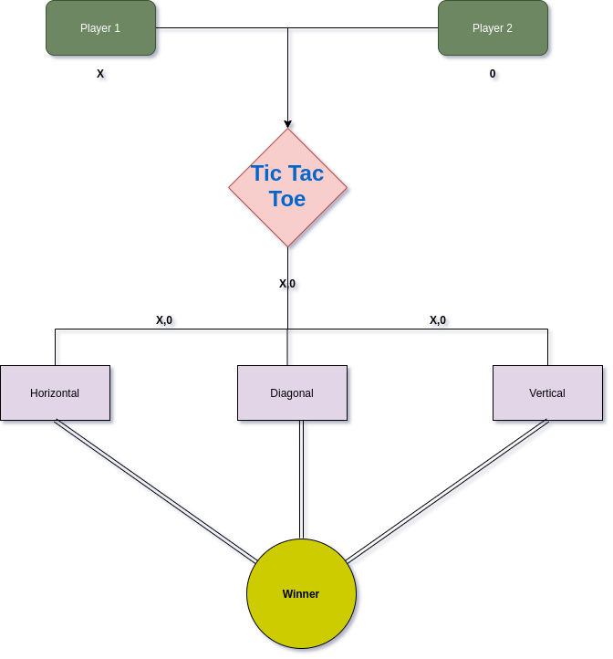
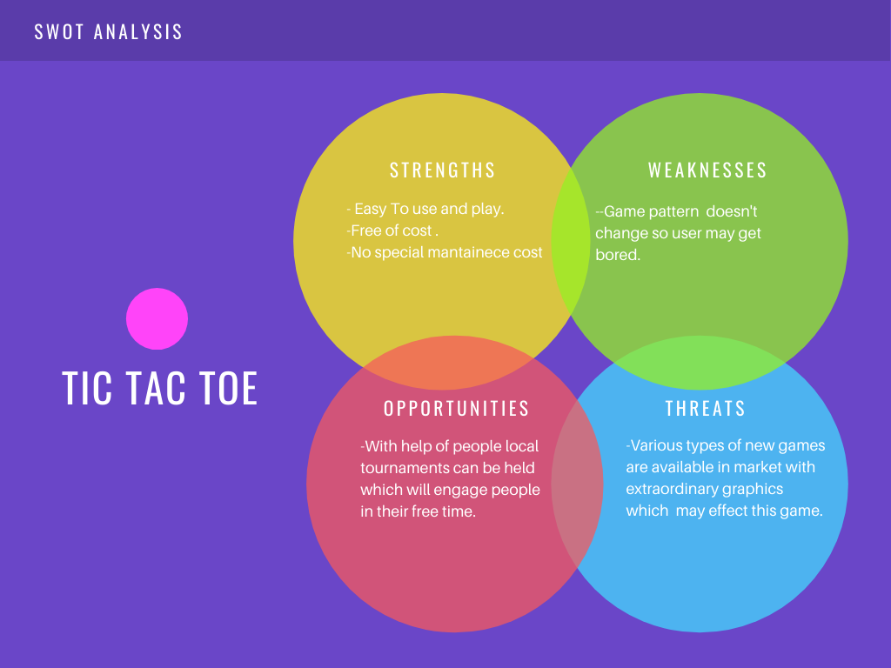

# Requirements

## **INTRODUCTION**

Tic Tac Toe is a game for two players, where there moves are based on two figures or characters i.e. "X" and "0" in a 3*3 space grid. The player who succeed in placing three respective marks of his choice in a horizontal,vertical, or diagonal row is declared as winner. This game is a pretty nice way to pass your free time
with your partner,friend etc. as it requires two players.

## **Research**

In late 90's people around the world started taking computers as their entertainment source and from that point of time gaming industry was taking its shape. So I decided to contribute towards it by developing this game which will help people to pass there free time.

## **Benefits**

- As talking of today, gaming industry is at boom as there are many games which people play to entertain themselves but some games are age restricted , some have violence such as killing people etc. but what my game offers is no age restriction and no violence . The controls of the game is so easy so both kid and old man can play it and pass their free time.

- Environment friendly game as it saves paper.

## **Cost and Features**

This game is entirely free of cost as it has no special requirements such as server hosting etc. So this is a money friendly game.

## **Design**

## **Swot Analysis**

# **Detailed Requirements**

## **High Level Requirements**

| **ID** | **Description** | **Category** | **Status** |
|--------|-----------------|--------------|------------|
|  HL01  | Player should see a 3*3 grid to play the game      | Technical    |   TBD      |
|  HL02  | Player should be able to choose square of his choice to put the mark| Technical |  TBD |
|  HL03  |Player should be declared as winner if he is able to match his mark diagonal,vertical or horizontal | Technical |  TBD |

## **Low Level Requirements**

| **ID** | **Description** | **Category** | **Status** |
|--------|-----------------|--------------|------------|
| LL01   |If player selects an square no which is already chose by another player display "Invalid move" | Technical | TBD |
| LL02   |If there is no outcome after specified moves then display "Game draw" | Technical | TBD |

